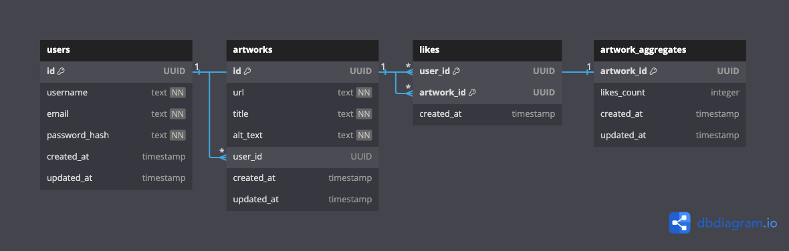

# Voxellery

A gallery for voxel art, because we love it!

Frontend built in React, backend built in Django, vibes built in the Caribbean 🌴

## Features

This project is a simple public gallery (think [Unsplash](https://unsplash.com)) for Voxel Art. Users can:

- View all uploaded voxel art images
- Upload voxel art to be displayed
- Like voxel art from other users
  - Not yet implemented

## Requirements

To run this app you need Docker (4.20+) installed locally.

## Why Make This?

I like making voxel art with [MagicaVoxel](https://ephtracy.github.io). It's fun!

<iframe width="560" height="315" src="https://www.youtube.com/embed/Vn0Ki_b-qzg?si=dPMOWq_50D9FgGcm" title="YouTube video player" frameborder="0" allow="accelerometer; autoplay; clipboard-write; encrypted-media; gyroscope; picture-in-picture; web-share" referrerpolicy="strict-origin-when-cross-origin" allowfullscreen></iframe>

## Architecture

### DB Schema

## Challenges

- Django's learning curve. It's been about 4 years since I used Django, and it's a lot of concepts to recall to get going. Thankfully, not much has changed since!
- Customising the user auth in Django isn't a simple switch. The docs have a useful guide, but there are few components to change to get it working
  - In this app the email is the unique field for users, and username is their display name. Not required, this change was done more out of curiousity
- I'd planned for the React app to be deployed separately, and statically hosted. So I needed to learn how to get a JWT and permissions set up for the backend. This, alongside other reasons, led me to using the Django REST Framework, instead of just returning JSON with the default Django setup.
- Next.js is cool because it has routing and many other things set up for ease of use. However, like Django, there's a lot to learn before you can get going...
  - Tailwind CSS looks amazing - very flexible and a large community. However, for the timeframe, it wasn't working for me. So I switched to Chakra UI, which I've used before
- Kind of shocked that Django still doesn't have a flexible CORS settings built-in. Thankfully, the plugin is easy to use <https://github.com/adamchainz/django-cors-headers>

## Credits

Block front from [Kenney](https://kenney.nl)
